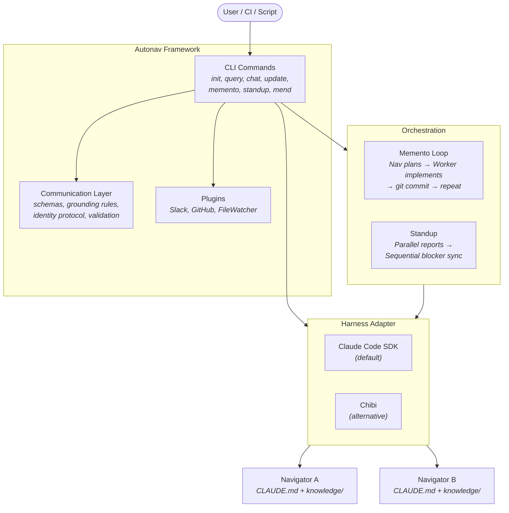

<div align="center">

```
    ___   __  ____________  _   _____    _    __
   /   | / / / /_  __/ __ \/ | / /   |  | |  / /
  / /| |/ / / / / / / / / /  |/ / /| |  | | / /
 / ___ / /_/ / / / / /_/ / /|  / ___ |  | |/ /
/_/  |_\____/ /_/  \____/_/ |_/_/  |_|  |___/
```

  <h3>Cultivate context, grow understanding</h3>

  [](https://www.npmjs.com/package/@autonav/core)
  [](https://www.npmjs.com/package/@autonav/core)
  [](./LICENSE)
  [](https://github.com/terraboops/autonav/actions)
  [](https://www.typescriptlang.org/)

</div>

---

## What Is a Navigator?

LLMs are powerful, but they hallucinate without context and forget between sessions. Building useful agents means solving two problems: **systematically curating context over time** so responses are grounded in real knowledge, and **scaling agent collaboration** so multiple agents can coordinate without drifting apart.

A navigator is an autonomous agent that engineers its own context to gain deeper insight about a topic — through conversations, shared knowledge, and iterative refinement. Concretely, it's a directory of text files (system prompt, knowledge base, configuration) with a framework around it that makes responses grounded, citeable, and trustworthy.

Autonav makes and manages navigators. Think of it as cultivating a software garden: you plant navigators with curated knowledge, they grow smarter through experience, and over time they become autonomous coworkers that produce real work. You're not commanding assembly-line machines — you're cultivating conditions for emergence.

---

## See It In Action

<!-- TODO: Replace with asciinema recording -->
```bash
$ autonav init platform-nav --pack platform-engineering
  ✔ Knowledge pack installed: platform-engineering v0.1.0
  ✔ Navigator created: platform-nav/

$ autonav query platform-nav "How do I debug a failing deployment?"
  Answer: Based on your deployment runbooks, start by checking...
  Confidence: 0.87
  Sources: knowledge/troubleshooting.md (lines 45-78), knowledge/deployment.md (lines 12-30)

$ autonav memento ./my-app ./platform-nav --branch feat/monitoring --task "Add health checks"
  ⣾ Iteration 1: Navigator planning... → Worker implementing...
  ✔ Committed: feat: add /health and /ready endpoints
  ⣾ Iteration 2: Navigator planning... → Worker implementing...
  ✔ Committed: test: add health check integration tests
  ✔ Complete (2 iterations, $0.08)
```

---

## Quick Start

```bash
# 1. Install
npm install -g @autonav/core

# 2. Create a navigator
autonav init my-assistant

# 3. (Optional) Add knowledge — markdown files about your domain
cp -r ~/my-docs/* my-assistant/knowledge/

# 4. Query it
autonav query my-assistant "How do I deploy?"

# 5. Or chat interactively
autonav chat my-assistant
```

Want the full walkthrough? See the **[Getting Started guide](docs/getting-started.md)**.

---

## What Can You Do?

### Autonomous Development Loops
**Memento**: A navigator plans, a worker implements, git is the only persistent memory. Each iteration starts fresh — the navigator reviews the git log, plans the next step, and a worker agent executes it. Runs unattended, produces commits.
**Standup**: Multiple navigators sync in parallel — status reports, blocker resolution, cross-domain coordination. Like real standups, but your agents never skip them.

### Your Personal Interface Layer
A navigator that knows you — your preferences, projects, and working style. It adapts to how you communicate and what you need. Start by chatting manually, refine the knowledge over time, eventually delegate real work.

### Domain-Specific Agents on the Fly
Create any expert: Terraform, Kubernetes, your team's component library. Just text files — git it, PR it, collaboratively refine the knowledge. Specialists and generalists both have their place, but a well-scoped navigator dramatically outperforms a broad one.

### Agent-to-Agent Communication
Navigators query each other using the Agent Identity Protocol. Domain authority stays clear. Drift gets caught. The whole is greater than the sum of its parts.

**[Explore all use cases →](docs/use-cases.md)**

---

## Security & Sandboxing

Autonav uses defense in depth — 9 independent layers restrict what navigator agents can do. Kernel-enforced sandboxing via [nono](https://github.com/always-further/nono) (Landlock, Seatbelt) and the Claude Code SDK (Seatbelt, bubblewrap) prevents unauthorized file and network access at the OS level. Each operation gets an appropriate sandbox profile: queries are read-only, updates get read+write, memento workers get full access. Additional layers include working directory scoping, tool allowlists, permission modes, turn/budget limits, cross-navigator cycle detection, ephemeral session directories, credential sanitization, and file watcher path restrictions.

Per-navigator sandbox profiles are configurable in `config.json`. All layers degrade gracefully when their underlying mechanism is unavailable.

**[Full security model →](docs/security-model.md)**

---

## Install

```bash
npm install -g @autonav/core
```

Requires Node.js >= 18 and Claude Code. See the **[Install guide](docs/install.md)** for details, troubleshooting, and alternative methods.

---

## Knowledge Packs

### Why Knowledge Packs?

Unlike skills, commands, or AGENTS.md files, autonav constructs exactly the right context from a knowledge base to answer a given query. A knowledge pack stitches together skills, commands, system prompts, and curated documentation into a cohesive agent — one that retrieves only the relevant context for each problem.

This makes knowledge packs a powerful way to share domain expertise across your team. Instead of writing documentation that sits in a wiki, you build a navigator that actively uses that knowledge to answer questions, guide decisions, and produce work.

### Creating Your Own

Any directory with a `metadata.json` and either `system-configuration.md` or a `knowledge/` directory is a valid pack:

```
my-pack/
├── metadata.json              # Name, version, description
├── system-configuration.md    # Navigator grounding configuration
├── knowledge/                 # Domain documentation
│   └── *.md
└── plugins.json               # Optional plugin config
```

Git it, share it with your team, or publish it for the community. See the **[Knowledge Pack Protocol](docs/KNOWLEDGE_PACK_PROTOCOL.md)** for hosting and distribution details.

### Installing Packs

```bash
# From the default pack server
autonav init my-nav --pack platform-engineering

# From GitHub
autonav init my-nav --pack github:owner/repo/packs/my-pack

# From a local tarball
autonav init my-nav --pack-file ./my-pack-0.1.0.tar.gz
```

**Available packs:**
- `platform-engineering` — Kubernetes, monitoring, incident response, deployment
- Community packs — [create and share your own](docs/KNOWLEDGE_PACK_PROTOCOL.md)

---

## Architecture



**Three Components:**

1. **Autonav Framework** — CLI commands, plugin system, memento loops, standup orchestration
2. **Communication Layer** — Response schemas, grounding rules, identity protocol, validation
3. **Knowledge Packs** — HTTP-distributed community content, domain expertise

The **harness adapter** contains the SDK dependency behind a universal interface, making autonav runtime-agnostic. Claude Code SDK is the default; Chibi is an alternative runtime that uses OpenRouter for model access.

---

## Development

```bash
git clone https://github.com/terraboops/autonav.git
cd autonav
npm install && npm run build
npm test
```

```bash
npm run dev                          # Watch mode
npm run typecheck                    # Type checking
AUTONAV_DEBUG=1 autonav query ...   # Debug logging
AUTONAV_METRICS=1 autonav query ... # Metrics collection
```

**Project structure:**
```
autonav/
├── packages/
│   ├── autonav/                # Main CLI and framework
│   └── communication-layer/    # Schemas, validation, templates
├── packs/
│   └── platform-engineering/   # Example knowledge pack
└── docs/                       # Documentation
```

---

## Contributing

PRs welcome. See **[CONTRIBUTING.md](./CONTRIBUTING.md)** for development workflow, code style, and PR guidelines.

**Help wanted:**
- Knowledge packs for popular domains (Kubernetes, AWS, Terraform, etc.)
- Documentation improvements
- Bug reports and feature requests

---

## Philosophy

**Cultivating a Software Garden.** Autonav treats multi-agent development like gardening, not manufacturing. Agents are autonomous coworkers, not assembly-line machines. You cultivate the conditions — curated knowledge, clear scope, grounding rules — and the system grows through emergence. Navigators get smarter over time through collaboration, shared knowledge, and iterative refinement.

**Stochastic Parrots as Feature.** LLMs don't create knowledge — they organize existing knowledge exceptionally well. Autonav embraces this by making context engineering the first-class concern, not fighting hallucinations after the fact.

**Navigators as LLM Abstraction.** Just as containers are the abstraction for deploying software, navigators are the abstraction for interacting with LLMs. Self-contained, version-controlled, shareable, composable.

**Community-Driven Knowledge.** Knowledge packs let anyone curate and share domain expertise. HTTP distribution means no gatekeeping, no package coordination. The best knowledge rises through use.

---

## License

Apache-2.0 © [Terra Tauri](https://terratauri.com)

---

## Learn More

| Resource | Description |
|----------|-------------|
| **[Getting Started](docs/getting-started.md)** | Create your first navigator, step by step |
| **[Install Guide](docs/install.md)** | Installation, configuration, troubleshooting |
| **[Use Cases](docs/use-cases.md)** | Personal agents, domain experts, autonomous dev loops |
| **[Knowledge Pack Protocol](docs/KNOWLEDGE_PACK_PROTOCOL.md)** | Create and distribute your own packs |
| **[Security Model](docs/security-model.md)** | Defense-in-depth sandboxing and security layers |
| **[CONTRIBUTING.md](./CONTRIBUTING.md)** | Development workflow and contribution guide |
