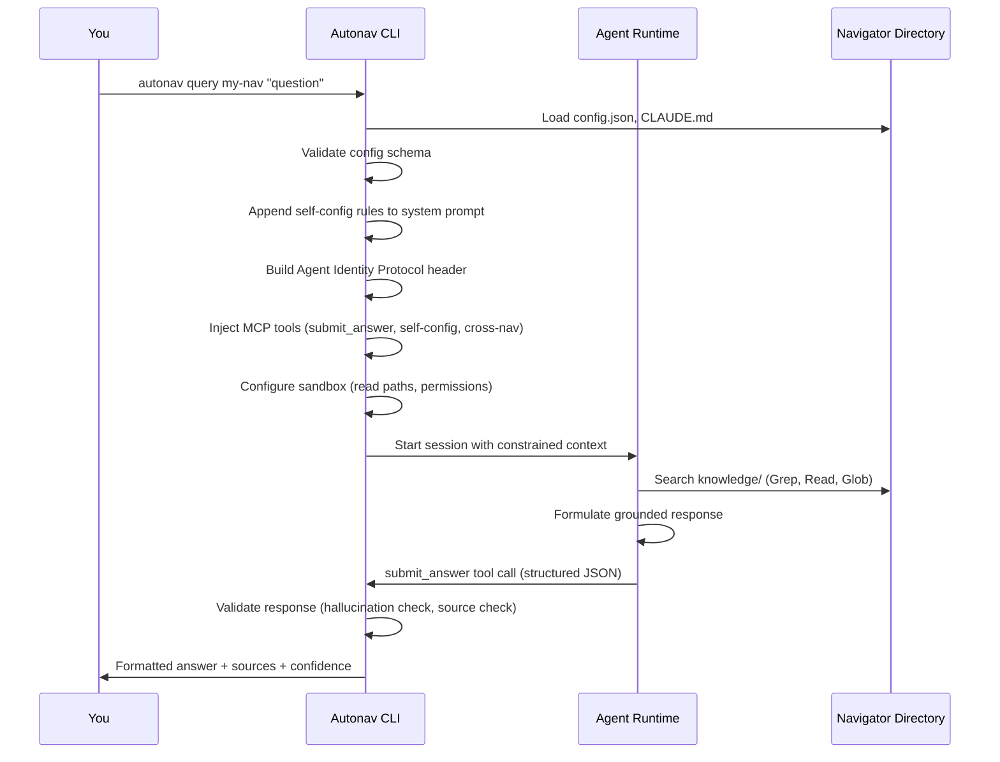

# Getting Started with Autonav

Autonav makes and manages **navigators** — autonomous agents that engineer their own context to gain deeper insight about a topic. A navigator is just a directory of text files: a system prompt, a knowledge base, and configuration. What makes it powerful is the framework around it — structured context engineering, grounded responses, and the ability to grow smarter through experience.

Think of it as cultivating a software garden: you plant a navigator with curated knowledge, tend it through conversations and updates, and over time it becomes an autonomous coworker that produces real work.

This guide walks you through creating your first navigator, populating it with knowledge, and querying it.

---

## See It In Action

<!-- TODO: Replace with asciinema recording of `autonav init` → query flow -->
```
$ autonav init my-assistant
  ✔ Navigator created: my-assistant/

$ autonav query my-assistant "What deployment strategy should I use?"
  Answer: Based on your knowledge base...
  Confidence: 0.85
  Sources: deployment.md (lines 12-45)
```

---

## Prerequisites

Before you start, you'll need:

| Requirement | Why |
|---|---|
| **Node.js >= 18** | Autonav is built on Node.js |
| **npm >= 9** (or pnpm) | Package management |
| **Claude Code** | Autonav uses Claude Code SDK as its default agent runtime |
| **Anthropic API key** | Powers the LLM behind your navigators |

If you're not sure whether you have these, see the [Install Guide](install.md) for detailed setup instructions.

---

## Your First Navigator

### Creating It

Run `autonav init` with a name for your navigator:

```bash
autonav init my-assistant
```

This launches an interactive interview that asks about your navigator's purpose, domain scope, and personality. Each question shapes the system prompt that will guide your navigator's behavior.

**What the interview is doing:** Every answer you give becomes part of the navigator's `CLAUDE.md` — its system prompt and grounding rules. The interview isn't just collecting data; it's engineering context. A well-scoped navigator with clear domain boundaries will give dramatically better answers than a vague, general-purpose one.

The interview is also a conversation with Claude — you can reference web pages, ask it to perform web searches, or provide links to documentation you want the navigator to understand. This research feeds directly into the construction of your navigator's system prompt and knowledge structure.

> **Tip:** Not sure what to put? Start narrow. A navigator scoped to "my team's Kubernetes deployment practices" will outperform one scoped to "everything about DevOps." You can always expand later.

> **Tip:** If your navigator would benefit from research, academic insights, or information compiled from many sources, consider using Claude web (or your favorite AI research tool) to generate a knowledge document before or during the interview. The navigator can use this to suggest better ways to structure its knowledge base.

If you want to skip the interview and use defaults:

```bash
autonav init my-assistant --quick
```

### What You Get

After init completes, you'll have a directory like this:

```
my-assistant/
├── config.json          # Navigator identity, version, and sandbox config
├── CLAUDE.md            # System prompt and grounding rules
├── knowledge/           # Your knowledge base (start adding docs here)
│   ├── agents/          # Agent identity definitions
│   └── README.md        # Guide for populating knowledge
├── .claude/
│   └── plugins.json     # Plugin configuration (Slack, GitHub, etc.)
├── .autonav/
│   └── skills/          # Local skill definitions (ask, update)
├── .gitignore
└── README.md
```

#### Sandbox Configuration

The `config.json` file supports a `sandbox` field for controlling per-operation security profiles and declaring tool requirements. If you mention CLI tools during the interview (e.g., `linear`, `gh`, `kubectl`), the interview will automatically configure `sandbox.allowedTools` for you.

You can also edit `config.json` directly:

```json
{
  "sandbox": {
    "allowedTools": ["Bash"],
    "query": { "enabled": true },
    "update": { "enabled": true },
    "chat": { "enabled": true },
    "standup": { "enabled": true },
    "memento": { "enabled": false }
  }
}
```

- **`allowedTools`**: Tool names this navigator always needs (e.g., `["Bash"]` to run CLI commands like `linear` or `gh`). This overrides tool restrictions in operations that block tools by default.
- **Per-operation profiles**: Enable or disable sandboxing per operation. Queries are read-only by default; updates get read-write access. Set `"enabled": false` to disable sandboxing for a specific operation.

See the **[Security Model](security-model.md)** for the full breakdown of how each layer works.

This is the **navigator-as-directory** pattern. Everything your navigator knows and is lives in this directory. It's git-friendly, portable, and composable. You can version it, PR it, and share it with your team.

### Starting From a Knowledge Pack

Knowledge packs are community-curated starter kits — pre-built knowledge bases for specific domains. Instead of starting from scratch, you can bootstrap your navigator with one:

```bash
autonav init my-platform-nav --pack platform-engineering
```

This downloads the `platform-engineering` pack (Kubernetes operations, monitoring, incident response) and populates your navigator's knowledge base with it. The interview will be tailored to the pack's domain.

Packs can come from multiple sources:

```bash
# From the default pack server
autonav init my-nav --pack platform-engineering

# From GitHub (full URL)
autonav init my-nav --pack https://github.com/owner/repo/tree/main/packs/my-pack

# From GitHub (shorthand)
autonav init my-nav --pack github:owner/repo/packs/my-pack

# From a local tarball (for development)
autonav init my-nav --pack-file ./my-pack-0.1.0.tar.gz
```

See the [Knowledge Pack Protocol](KNOWLEDGE_PACK_PROTOCOL.md) for details on creating and distributing your own packs.

---

## Adding Knowledge

A navigator without knowledge is like a new hire without onboarding. The `knowledge/` directory is where you give your navigator the context it needs to be useful.

### What Goes In Knowledge

Add markdown files covering the topics you want your navigator to know about:

```
knowledge/
├── deployment.md         # How your team deploys
├── architecture.md       # System architecture overview
├── troubleshooting.md    # Common issues and solutions
├── runbooks/
│   ├── incident.md       # Incident response procedures
│   └── rollback.md       # Rollback procedures
└── decisions/
    └── why-kubernetes.md  # Architecture decision records
```

### What Makes Good Knowledge Content

Autonav uses agentic retrieval — the agent actively searches your knowledge base with tools like Grep, Read, and Glob. This is remarkably capable, but it's not magic. The quality of your responses depends on how well your knowledge is written and organized.

**Follow prompt engineering best practices.** Your knowledge files are part of the context that shapes LLM behavior. Write them the same way you'd write a good prompt: be specific, use clear structure, and avoid ambiguity. See [Anthropic's prompt engineering guide](https://docs.anthropic.com/en/docs/build-with-claude/prompt-engineering/overview) for principles that apply directly to knowledge content.

**Keep the knowledge base discoverable.** As a knowledge base grows, the agent has a harder time finding the right piece of information. Use descriptive file names, clear headings, and consistent structure so the agent can quickly locate what it needs.

**Eliminate conflicting information.** Contradictory knowledge is poison. If two files say different things about the same topic, the navigator may confidently cite the wrong one. When things change, update or remove the old information — don't just add a new file alongside it.

**Keep it small and focused.** A focused knowledge base dramatically outperforms a large, sprawling one. Each navigator should cover a well-defined domain. If you find your knowledge base growing past a few dozen files, consider splitting into multiple navigators. Use `autonav mend --review` to detect contradictions and quality issues.

**Include procedures, not just facts.** Navigators excel at guiding someone through a process. Step-by-step runbooks, decision trees, and troubleshooting flows are high-value content.

**Keep it current.** Outdated knowledge is worse than no knowledge. The navigator will confidently cite it. Use `autonav update` to help your navigator maintain its own docs over time.

### Importing an Existing Repository

If you already have documentation in a repository, you can import it:

```bash
# Create a navigator from an existing repo
autonav init my-nav --from /path/to/your/repo

# Or add navigator config directly into the source repo
autonav init --from /path/to/your/repo --in-place
```

The `--from` flag scans the repository, analyzes its content with Claude, and generates a navigator configuration tailored to what it finds. The `--in-place` flag adds the config files directly into the source repo instead of creating a new directory.

---

## Querying Your Navigator

Once your navigator has some knowledge, you can start asking questions.

### Single-Shot Queries

For quick, one-off questions:

```bash
autonav query my-assistant "How do I deploy to staging?"
```

The response includes the answer, confidence score, and source citations — the specific files and sections the navigator drew from.

#### Output Formats

```bash
# Pretty output (default) — colored, formatted for humans
autonav query my-assistant "How do I deploy?"

# Compact output — answer + minimal sources
autonav query my-assistant "How do I deploy?" --compact

# JSON output — full structured response
autonav query my-assistant "How do I deploy?" --json

# Raw output — just the answer text, nothing else
# (Useful for piping to other tools or agent-to-agent queries)
autonav query my-assistant "How do I deploy?" --raw
```

### Interactive Chat

For exploratory conversations where you want to ask follow-up questions:

```bash
autonav chat my-assistant
```

This opens a multi-turn conversation. The navigator maintains context across messages, so you can drill into topics naturally:

```
You: How is our monitoring set up?
Navigator: Your monitoring stack uses Prometheus for metrics collection...

You: What alerts should I set up for a new service?
Navigator: Based on your monitoring standards, new services should have...

You: /status
Navigator status: platform-assistant v1.0.0 | knowledge: 12 files | session: 3 messages
```

**Chat commands:** Type `/help` for available commands, `/status` to check navigator state, `/clear` to reset conversation, and `/exit` to leave (or Ctrl+C).

### When to Use Which

| Scenario | Command | Why |
|---|---|---|
| Quick factual question | `query` | One answer, move on |
| Exploring a topic or planning your day | `chat` | Follow-up questions need context; also useful for interactively updating your navigator's knowledge |
| CI pipelines and automation | `query --raw` | Clean output for integration into scripts and workflows |
| Debugging a response | `query --json` | See confidence, sources, metadata — diagnose why an answer is wrong |
| Agent-to-agent queries | `query --raw` | No formatting, just the answer for piping between navigators |

---

## Understanding Responses

Every navigator response is **grounded** — tied to specific sources in the knowledge base. This is fundamental to how autonav works and what separates it from a generic LLM conversation.

### Response Structure

When you use `--json`, you'll see the full response:

```json
{
  "protocolVersion": "0.1.0",
  "query": "How do I deploy to staging?",
  "answer": "To deploy to staging, run the deployment pipeline...",
  "sources": [
    {
      "file": "knowledge/deployment.md",
      "section": "Staging Environment",
      "relevance": "Primary deployment procedure"
    }
  ],
  "confidence": 0.85,
  "timestamp": "2026-02-16T10:30:00Z"
}
```

### Confidence Scores

The confidence score (0.0–1.0) tells you how well the navigator's knowledge base covers the question:

| Range | Meaning |
|---|---|
| **0.8–1.0** | Strong coverage — the answer is well-supported by knowledge base sources |
| **0.5–0.8** | Partial coverage — some relevant knowledge exists, but gaps remain |
| **0.0–0.5** | Weak coverage — the navigator is mostly reasoning from general knowledge, not its knowledge base |

You can set a minimum threshold:

```bash
# Only accept high-confidence answers
autonav query my-nav "How do I deploy?" --confidence high
```

### Source Citations

Every answer cites its sources — the specific files and sections from the knowledge base that informed the response. This is how you verify the navigator isn't hallucinating.

If a response has no sources, that's a signal that the question falls outside the navigator's domain. Consider adding relevant knowledge or using a different navigator.

### Grounding Rules

Behind the scenes, every navigator follows strict grounding rules embedded in its `CLAUDE.md`:

- **Cite sources** for every factual claim
- **Acknowledge uncertainty** when knowledge is incomplete
- **Stay in domain** — refuse questions outside the navigator's scope
- **No fabrication** — if the knowledge base doesn't cover it, say so

These rules are what make navigators trustworthy. A navigator that says "I don't have information about that" is doing its job correctly.

---

## What's Actually Happening

When you query a navigator, autonav does significant work to set up the agent context before the LLM ever sees your question.



Here's what happens at each stage:

1. **Load and validate** — Autonav reads `config.json` (validates against schema), loads `CLAUDE.md` as the system prompt, and initializes any configured plugins from `.claude/plugins.json`
2. **Engineer the context** — This is where autonav adds significant value. It appends self-configuration rules to the system prompt, constructs the Agent Identity Protocol header (establishing the navigator's authority and domain), and injects MCP tool servers:
   - `submit_answer` — enforces structured JSON responses with required fields (answer, sources, confidence)
   - `self-config tools` — lets the navigator update its own plugin configuration
   - `cross-nav query` — allows the navigator to query other navigators
3. **Constrain the runtime** — Applies defense-in-depth sandboxing: kernel-enforced file isolation (Seatbelt/Landlock via [nono](https://github.com/always-further/nono) or the SDK sandbox), working directory scoping to the navigator directory, permission bypass for non-interactive use, and turn limits to prevent runaway execution. Each operation gets an appropriate sandbox profile — queries are read-only, updates get read+write. See the **[Security Model](security-model.md)** for the full 9-layer breakdown
4. **Agent searches and reasons** — The agent runtime (Claude Code SDK by default) receives the engineered context and uses file tools to search the knowledge base for relevant information
5. **Structured response** — The agent calls `submit_answer` with a typed response (answer, sources array, confidence level, out-of-domain flag). This structured output is validated against the schema
6. **Post-validation** — Autonav checks for hallucination patterns, verifies cited source files exist, and validates the confidence level meets any threshold you set

The **navigator-as-directory** pattern means all of this context is local, inspectable, and version-controlled. There's no hidden state, no external database, no opaque configuration. Everything your navigator knows is in that directory.

---

## Next Steps

Now that you have a working navigator, here's where to go next:

- **[Use Cases Guide](use-cases.md)** — Discover what you can build: personal interface layers, domain agents, autonomous development loops
- **[Install Guide](install.md)** — Detailed installation and configuration options
- **[Knowledge Pack Protocol](KNOWLEDGE_PACK_PROTOCOL.md)** — Create and distribute your own knowledge packs
- **Update your navigator** — Run `autonav update my-assistant "Add information about..."` to have your navigator maintain its own knowledge
- **Health check** — Run `autonav mend my-assistant` to verify your navigator is properly configured, or `autonav mend my-assistant --review` for an LLM-powered quality review
- **Try memento** — Run `autonav memento ./my-code ./my-nav` for autonomous development loops where the navigator plans and a worker implements
