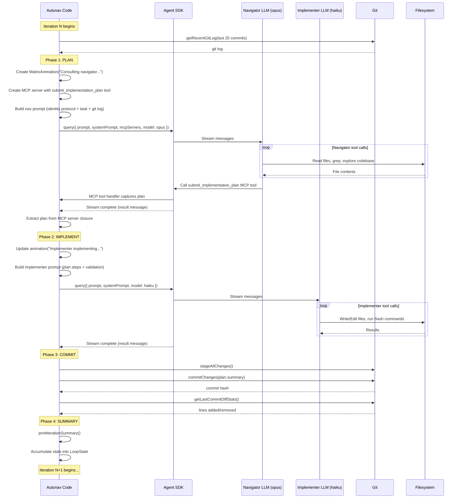
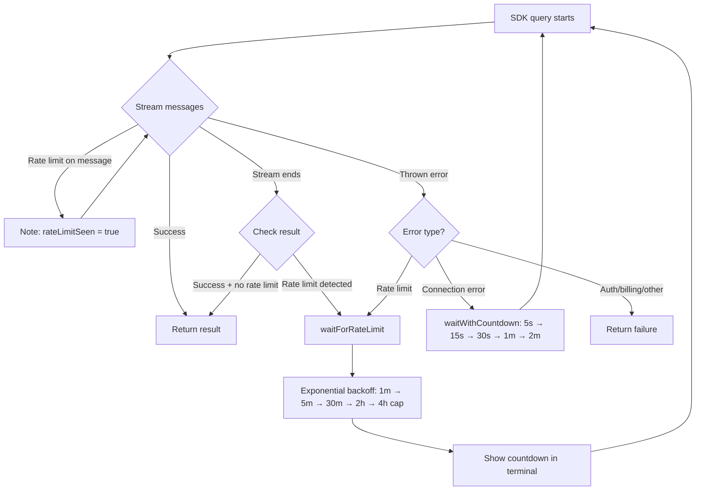

# Memento Loop Architecture

Detailed architecture documentation for the autonav memento loop.
Last updated: 2026-02-08

## Overview

The memento loop is a context-clearing iterative development pattern. A **navigator** (opus) plans work, an **implementer** (haiku) executes it, and **git** is the only persistent memory. The implementer forgets everything between iterations — only git history carries forward.

```
User Task ──> [Navigator plans] ──> [Implementer implements] ──> [Git commit] ──> repeat
                   opus                    haiku                  autonav code
```

## Control Flow Layers

Three layers participate in every operation:

| Layer | Color | What it does |
|-------|-------|-------------|
| **Autonav code** | Blue | Orchestrates phases, manages state, handles errors, drives animation |
| **Claude Agent SDK** | Yellow | Spawns Claude Code processes, manages streaming, handles API retries |
| **LLM (Claude)** | Green | Makes decisions, calls tools, generates code, reads files |

External systems (git, filesystem, MCP servers) are invoked by the LLM through the SDK's tool layer.

## Entry Point

```
CLI: autonav memento <code-dir> <nav-dir> [options]
  │
  ├─ nav-memento.ts     Parse CLI args, resolve paths
  │
  └─ loop.ts: runMementoLoop()
       │
       ├─ Load navigator config + system prompt
       ├─ handleUncommittedChanges()   ← interactive user prompt
       ├─ Create/switch git branch
       │
       └─ MAIN LOOP (while iterations remain)
            ├─ Phase 1: Navigator plans
            ├─ Phase 2: Implementer implements
            ├─ Phase 3: Commit
            └─ Phase 4: Summary + next iteration
```

## Main Loop: Detailed Flow

### Per-Iteration Sequence Diagram



### Rate Limit / Error Retry Flow



## Data Flow: What Goes In and Out

### Navigator (Plan Phase)

**IN:**
```
System Prompt:
  └─ Navigator's CLAUDE.md (from nav directory)
  └─ "Memento Loop Navigator Role" instructions
  └─ "Be specific", "use conventional commits", etc.

User Prompt:
  └─ Agent Identity Protocol header
  │   └─ "Hello {name}. This is Autonav Memento Loop..."
  │   └─ Navigator's role + authority affirmation
  └─ Task description (from user)
  └─ Iteration info ("Iteration 3 of 10")
  └─ Code directory path + branch
  └─ Git log (last 20 commits)
  └─ Instructions: analyze → determine → create → submit tool

MCP Tools Available:
  └─ submit_implementation_plan (custom MCP server, in-process)

SDK Tools Available:
  └─ All Claude Code tools (Read, Write, Edit, Bash, Grep, Glob, etc.)
```

**OUT:**
```
ImplementationPlan (via MCP tool):
  ├─ summary: string        "feat: add user authentication"
  ├─ steps[]:
  │   ├─ description: string
  │   ├─ files?: string[]
  │   └─ commands?: string[]
  ├─ validationCriteria: string[]
  ├─ isComplete: boolean
  └─ completionMessage?: string

Metrics:
  ├─ tokensUsed (input + output)
  └─ lastTool
```

### Implementer (Implement Phase)

**IN:**
```
System Prompt:
  └─ "You are an Implementer Agent"
  └─ "Execute each step", "Verify work", "Review code"
  └─ Working directory path

User Prompt:
  └─ Plan summary
  └─ Steps (numbered, with files + commands)
  └─ Validation criteria checklist
  └─ Instructions: implement → validate → review → fix → report

SDK Tools Available:
  └─ All Claude Code tools (Read, Write, Edit, Bash, Grep, Glob, etc.)

NO MCP tools, NO agent identity protocol, NO git history
```

**OUT:**
```
ImplementerResult:
  ├─ success: boolean
  ├─ summary: string
  ├─ filesModified: string[]
  ├─ errors?: string[]
  └─ tokensUsed (accumulated across retries)
```

## State Management

### What Persists Between Iterations

| Data | Storage | Visible To |
|------|---------|-----------|
| Code changes | Git commits | Navigator (via git log) |
| Iteration count | In-memory LoopState | Autonav code |
| Plan history | In-memory LoopState | Autonav code (for PR body) |
| Cumulative stats | In-memory LoopState | Animation status bar |

### What Is Forgotten (Memento Pattern)

| Data | Forgotten By |
|------|-------------|
| Previous plans | Implementer (new SDK session each iteration) |
| Previous code context | Implementer |
| Tool call history | Both agents (new sessions) |
| Conversation history | Both agents |

The navigator maintains continuity through its own knowledge base (files in nav directory) and the git history provided by autonav.

### LoopState (in-memory only)

```typescript
{
  iteration: number,
  completionMessage?: string,
  planHistory: Array<{ iteration: number, summary: string }>,
  stats: {
    linesAdded: number,
    linesRemoved: number,
    tokensUsed: number,
    lastTool?: string,
  }
}
```

## Token Usage Patterns

| Phase | Model | Typical Turns | Token Characteristics |
|-------|-------|---------------|----------------------|
| Navigator Plan | opus | 5-30 | High: reads codebase, thinks deeply |
| Implementer | haiku | 10-50 | Medium: writes code, runs commands |
| Commit msg gen | haiku | 1 | Low: single-turn, small diff |

The **Agent Identity Protocol** adds ~150 tokens per navigator call. The navigator system prompt (CLAUDE.md) can be large depending on the nav's knowledge base.

### Where Tokens Are Spent

```
Navigator Call:
  ├─ System prompt: nav CLAUDE.md + role instructions (~2000-5000 tokens)
  ├─ User prompt: identity protocol + task + git log (~500-2000 tokens)
  ├─ Tool definitions: submit_implementation_plan schema (~300 tokens)
  ├─ Tool calls: reading files, grepping code (variable, often large)
  └─ Output: plan submission (~200-500 tokens)

Implementer Call:
  ├─ System prompt: role + guidelines (~300 tokens)
  ├─ User prompt: plan + steps + validation (~300-1000 tokens)
  ├─ Tool calls: writing/editing files, running commands (variable)
  └─ Output: summary text (~100-300 tokens)
```

## Animation System

The `MatrixAnimation` renders a status display during agent execution:

```
  └─ Fix auth validation logic and add tests     ← Plan summary (printed above rain)
░▒▓█ 4 310█ ▒07█ 75▒2 ▓04█ 3□71█ 5█  Unstoppable...  ← Rain + mood text
Iter: 1  Impl: haiku-4-5  Nav: opus-4-6  Turns: 24  Diff: +12/-3  Tool: Edit  ← Status bar
```

**Mood text** is selected based on:
- Phase (nav vs impl)
- Tool being used (Read, Write, Bash, etc.)
- Error state (consecutive successes vs recent errors)
- Tool count (early vs flowing)

Animation is stopped/started around printed output to prevent cursor corruption. The `start()` method resets `tick=0` to avoid overwriting lines above the animation area.

## Key Files

| File | Purpose |
|------|---------|
| `cli/nav-memento.ts` | CLI entry point, arg parsing |
| `memento/loop.ts` | Main orchestration loop, all phase coordination |
| `memento/prompts.ts` | All prompts for navigator + implementer |
| `memento/nav-protocol.ts` | MCP server with submit_implementation_plan tool |
| `memento/types.ts` | Zod schemas for ImplementationPlan, ImplementerResult |
| `memento/implementer-agent.ts` | Standalone implementer (used outside loop) |
| `memento/matrix-animation.ts` | Terminal animation with status bar |
| `memento/rate-limit.ts` | Rate limit detection, backoff, countdown |
| `memento/git-operations.ts` | Git helpers (commit, diff, branch, push, PR) |
| `communication-layer/src/prompts/identity-protocol.ts` | Agent Identity Protocol builder |

## Design Observations

### Token Waste
- The implementer prompt includes review/validation instructions that the implementer may or may not follow. This is unreliable self-review.
- The Agent Identity Protocol is sent every navigator call, even though the navigator already has its CLAUDE.md.
- Validation criteria are passed to the implementer but there's no structured verification.

### Missing Phases
- No explicit review phase — review is bundled into implementer instructions
- No explicit commit message generation — plan summary used directly
- No verification that validation criteria actually passed

### Strengths
- Clean separation: navigator plans, implementer executes
- Git as single source of truth works well for the memento pattern
- Rate limit retry with infinite backoff is robust
- MCP tool for plan submission gives structured output reliably
