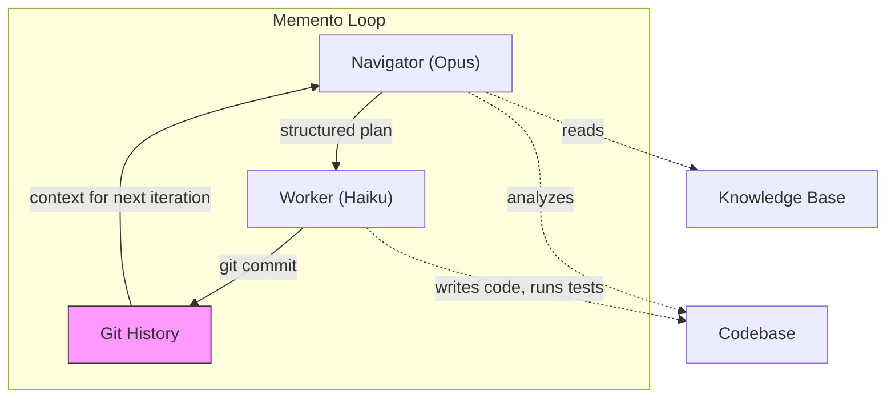

# What You Can Do with Autonav

A navigator is any system that engineers its own context for the purposes of gaining deeper insight about a topic by going through experiences — like chatting with you. Autonav is a structured way of executing harnesses to engineer context and to utilize that engineered context for solving large problems with agent swarms. Autonav makes and manages navigators automatically.

Think of it as cultivating a software garden. You aren't commanding machines on an assembly line — you're creating the conditions for agents to grow smarter through collaboration, shared knowledge, and iterative refinement. The system is designed for emergence: navigators that improve over time, that develop expertise through experience, that become genuine collaborators in your work.

This guide covers what that means in practice.

---

## Autonomous Development: Memento + Standup

This is the heart of autonav — where navigators stop being tools you talk to and start being agents that produce work autonomously.

### Memento: Autonomous Development Loops

LLMs perform measurably better when they have more available context window to work with. Research on long-context models (including Anthropic's own findings on "lost in the middle" effects) shows that relevant information buried deep in a packed context gets overlooked, while models with focused, clean context produce dramatically better output.

The `memento` command exploits this directly. Named after the Christopher Nolan film where the protagonist can't form new memories, memento creates a development loop where the **worker agent forgets everything between iterations** — starting each cycle with a completely clean context window. The *navigator* maintains strategic continuity through its knowledge base and the git history, while the worker gets the luxury of a fresh start every time.

This means the worker never gets bogged down by accumulated context, never confuses instructions from iteration 3 with decisions from iteration 7. It just reads the plan, implements it with full focus, and commits. The navigator handles the thinking across time.

```bash
autonav memento ./my-code ./my-nav --branch feat/auth --task "Implement user authentication"
```

#### How the Loop Works



Each iteration:

1. **Navigator analyzes** — reads the codebase, consults its knowledge base, reviews the git history to see what's been done so far
2. **Navigator plans** — submits a structured implementation plan with specific steps, files to modify, commands to run, and validation criteria
3. **Worker implements** — a fresh agent (no memory of previous iterations) executes the plan precisely
4. **Navigator reviews** — at the start of the next iteration, the navigator reviews the worker's output through git history and plans corrections or next steps. This is the important quality gate — the navigator has domain knowledge and strategic awareness that the worker lacks
5. **Loop repeats** — each cycle produces a commit, and the navigator's review drives the next plan

The key insight is the **memento pattern**: the worker forgets everything between iterations, but the git history provides continuity. The *navigator* maintains strategic awareness through its knowledge base and reviews the worker's progress each cycle.

#### Why Two Agents?

The split serves a purpose:

- **Navigator (Opus)**: Expensive, strategic, maintains the big picture. Plans carefully. Reviews the worker's output.
- **Worker (Haiku)**: Cheap, fast, executes precisely. Doesn't overthink. Gets a clean context every time.

This means the expensive model only runs once per iteration (to plan and review), while the cheap model does the heavy lifting (implementation). It's dramatically more cost-effective than running a single expensive model for everything.

#### What Memento Produces

- **Git history**: Every iteration produces a commit with a clear summary
- **Reviewed code**: The navigator reviews what the worker produced at each iteration, course-correcting as needed
- **A PR** (optional): Use `--pr` to automatically push a branch and create a pull request when done

```bash
# Run 5 iterations, then create a PR
autonav memento ./my-code ./my-nav \
  --branch feat/auth \
  --task "Implement user authentication with JWT" \
  --max-iterations 5 \
  --pr
```

#### Task Definition

You don't need to specify a task. By default, the navigator will simply ask for the next unit of work based on its knowledge of the project. This is powerful when the navigator already understands your roadmap — it picks up where things left off.

If you want the memento loop to focus on a specific task:

```bash
# Via flag
autonav memento ./code ./nav --task "Add rate limiting to the API"

# Via file (create TASK.md in the code directory)
autonav memento ./code ./nav
```

Leave *how* to the navigator. It has domain knowledge — that's its job.

#### Customizing the Models

```bash
# Default: Opus navigates, Haiku implements
autonav memento ./code ./nav

# Sonnet for both (balanced cost/quality)
autonav memento ./code ./nav --nav-model claude-sonnet-4-5 --model claude-sonnet-4-5

# Opus for both (maximum quality, higher cost)
autonav memento ./code ./nav --nav-model claude-opus-4-5 --model claude-opus-4-5
```

### Standup: Multi-Navigator Sync

The `standup` command orchestrates multiple navigators in parallel — each reports its status, then they sync on blockers:

```bash
autonav standup ./frontend-nav ./backend-nav ./infra-nav
```

#### How Standup Works

**Phase 1 — Parallel Reports**: Each navigator independently assesses its domain and produces a status report. This happens in parallel for speed.

**Phase 2 — Blocker Sync**: Navigators are shown each other's blockers and asked if they can help resolve cross-domain issues. This happens sequentially so each navigator sees prior resolutions.

```
Autonav Standup
────────────────────────────────
Navigators: frontend-nav, backend-nav, infra-nav
Model: claude-sonnet-4-5
Max budget: $1.00/agent
────────────────────────────────

[Phase 1] Generating reports...
  ✔ frontend-nav: 2 updates, 1 blocker
  ✔ backend-nav: 3 updates, 0 blockers
  ✔ infra-nav: 1 update, 2 blockers

[Phase 2] Syncing blockers...
  ✔ frontend-nav blocker resolved by backend-nav
  ✔ infra-nav blocker 1 resolved by frontend-nav
  ⚠ infra-nav blocker 2 unresolved

Standup complete!
Duration: 45.2s
Blockers: 3 reported, 2 resolved
Total cost: $0.1234
```

#### When to Use Standup

Like real software teams, agentic teams drift. Unlike real software teams, agentic teams work faster, work tirelessly, and drift in ways humans never would — subtle misunderstandings compound across iterations rather than getting caught in hallway conversations. Standups are how you catch this.

- **Regularly during autonomous work**: If you're running memento loops 24/7, standup at least every 4 hours to catch drift early
- **Before memento**: Surface blockers before they waste iterations
- **After major changes**: When one domain changes significantly, standup identifies cross-domain impacts
- **Team coordination**: When multiple people work on different navigators, standup finds integration issues

```bash
# Quick report, no sync
autonav standup ./nav-a ./nav-b --report-only

# Budget-conscious standup
autonav standup ./nav-a ./nav-b --max-budget 0.50 --model claude-haiku-4-5
```

### How Memento and Standup Work Together

The real power emerges when you use both:

1. **Standup** across your navigators to identify blockers and priorities
2. **Memento** loops on specific tasks, guided by navigators that are now aligned
3. **Standup** again to verify cross-domain consistency after memento produces code
4. **Repeat** — the navigators get smarter with each cycle

This is cultivating a software garden at scale: you set the conditions, the navigators grow through experience, the standups keep everything aligned, and the whole system produces working code while staying grounded in your knowledge.

---

## Your Personal Interface Layer

A navigator scoped to *you* is one of the most rewarding things you can build with autonav. It's an agent that knows your projects, your preferences, and your way of thinking — a collaborator you can configure to interact with you exactly how you work best, whether that's direct critical feedback, gentle encouragement, structured check-ins, or anything in between.

### A Notebook That Thinks Back

Create a navigator scoped to your personal workflow:

```bash
autonav init my-brain
```

During the `autonav init` interview, you'll describe what this navigator is for, how it should communicate with you, and what domains it should cover. The interview shapes the navigator's system prompt — it's the most important step in creating a navigator that actually feels useful.

Once created, start having conversations:

```bash
autonav chat my-brain
```

```
You: What are all the open threads I have right now?
Navigator: Based on your notes, you have 4 active threads:
  1. The auth refactor (blocked on API design review)
  2. Knowledge pack distribution protocol (exploring HTTP vs npm)
  3. That monitoring gap you noticed last week...

You: Which one should I focus on today?
Navigator: The auth refactor has been blocked longest and you noted
  it's blocking two other tasks. I'd suggest starting there.
```

This isn't a chatbot. It's a reflection of your own context, organized and queryable. The navigator's answers come from *your* knowledge base, grounded and cited.

### Personalization Over Time

Want to adjust how your navigator talks to you? Just ask it:

```bash
autonav update my-brain "I prefer direct, critical feedback over encouragement. When planning, use bullet points not prose. I'm neurodivergent and work better with explicit structure."
```

The navigator updates its own configuration to reflect your preferences. You don't need to manually edit files — the navigator manages its own knowledge base. Over time, it learns what works for you through these conversations.

### The Arc: Refine, Then Automate

A personal navigator starts as a collaborator you talk to. Over time, as its knowledge base grows and its grounding improves, you can start delegating:

1. **Manual phase**: Chat and query, building up knowledge
2. **Refinement phase**: Correct mistakes, add missing context, sharpen scope
3. **Delegation phase**: Use it in memento loops and standups to produce real work

This arc — from manual to autonomous — is the core journey of every navigator. You're cultivating conditions for growth, not programming a machine.

---

## Domain-Specific Agents on the Fly

Need an expert on Terraform? Kubernetes? Your team's React component library? Create a navigator for it.

### Create Any Agent

The `autonav init` interview is where domain navigators come to life. During the interview, you can:

- Describe the domain and its boundaries in detail
- Reference web pages or documentation that the navigator should understand
- Ask autonav to perform web searches to gather relevant information
- Provide links to existing docs, runbooks, or specs

All of this feeds into the construction of the navigator — shaping its system prompt, its grounding rules, and its initial knowledge structure.

```bash
# Start the interview — describe your Terraform patterns, reference your docs
autonav init terraform-nav

# Import an existing repo as a knowledge base
autonav init our-components --from ./packages/ui-components --in-place
```

Every domain navigator is just text files — `CLAUDE.md` for grounding rules, `knowledge/` for domain content. This means you can:

- **Git it**: Version control your navigators alongside your code
- **PR it**: Review knowledge base changes through pull requests
- **Collaborate**: Team members can refine knowledge, sharpen scope, improve quality
- **Share it**: Package your navigator as a knowledge pack for others to use

### The Art of Scoping

It's tempting to create one broad navigator that "knows everything." Broad navigators will work — they're not broken. But there are real benefits to splitting into focused specialists:

- **Better context**: A narrow navigator has deeper, more specific context for its domain. Less noise means less hallucination.
- **Custom tools and skills**: Each navigator can have its own set of tools, commands, and skills tailored to its domain.
- **Clearer authority**: When navigators communicate, clear domain boundaries prevent confusion about who's the expert on what.
- **Easier maintenance**: Smaller knowledge bases are easier to keep current and consistent.

Think of it like specialists vs generalists on a team. Neither is inherently better, but a Kubernetes specialist will dramatically outperform a generalist when you're debugging a CrashLoopBackOff at 2am.

```bash
# Three focused navigators instead of one broad one
autonav init our-deployments    # How we deploy, specifically
autonav init our-monitoring     # Our Prometheus + Grafana setup
autonav init incident-response  # Our runbooks and escalation paths
```

When a question spans domains, that's what agent-to-agent communication is for (see above).

### Curate Over Time

Knowledge bases aren't static. As your understanding of a domain deepens, so should your navigator's:

```bash
# Have the navigator update its own docs based on what happened
autonav update our-deployments "We switched from Helm to Kustomize last week. Update the deployment docs."

# Navigators can also explore your codebase directly — give them access
# and they'll use search tools to discover what changed
autonav update our-deployments "Scan the infra/ directory and update the deployment docs to reflect the current state."
```

The `update` command lets the navigator write to its own knowledge base — it has full agent capabilities including file search, code exploration, and writing. The navigator isn't just recording what you tell it; it can investigate and discover things on its own.

After making changes, verify everything is consistent:

```bash
# Health check — catches contradictions, missing sections, structural issues
autonav mend our-deployments

# Auto-fix common problems
autonav mend our-deployments --auto-fix

# Deep quality review using LLM analysis of your CLAUDE.md
autonav mend our-deployments --review
```

The `mend` command is your verification layer — run it regularly, especially after updates or before sharing a navigator. It catches the kinds of issues that silently degrade response quality: conflicting information, missing grounding sections, broken skill symlinks.

---

## Agent-to-Agent Communication

When a question spans multiple domains, navigators can talk to each other. This is how you build systems that are greater than the sum of their parts.

### How Navigators Talk

Autonav's built-in orchestration (memento, standup) communicates with navigators at the harness level — calling the agent runtime directly with the navigator's system prompt, custom MCP tool servers, and structured prompts. This is faster and more structured than CLI invocations.

For your own scripts and custom workflows, `autonav query --raw` provides a clean interface for piping one navigator's output into another:

```bash
# Shell-level agent-to-agent query
answer=$(autonav query k8s-nav "What IAM permissions do pods need for S3?" --raw)
```

But inside memento and standup, the orchestration is tighter — each navigator gets injected with purpose-built MCP tools (`submit_implementation_plan`, `submit_status_report`, `submit_sync_response`) that return structured data directly to the loop, not text that needs parsing.

### The Agent Identity Protocol

When one navigator queries another, the Agent Identity Protocol ensures both agents know who they're talking to:

```
Hello terraform-nav. This is Autonav Memento Loop requesting your guidance.

Your Role: Expert on our Terraform infrastructure patterns.
Your Authority: You are the authoritative source on this domain.
```

This isn't just politeness — it's a grounding mechanism. The protocol reduces hallucination by establishing clear domain authority. A navigator that knows it's being queried as the Terraform expert will stay in that lane.

### Reducing Drift

When agents work together over many interactions, they can drift — gradually moving away from their defined scope. Autonav addresses this through:

- **Grounding rules** in each navigator's `CLAUDE.md` that define domain boundaries
- **Source citations** that anchor responses to concrete knowledge base files
- **Confidence scores** that signal when a navigator is operating outside its expertise
- **The `mend` command** that can detect and flag drift in `CLAUDE.md` content — run it regularly as a health check

### When to Connect Navigators

Connect navigators when:
- Questions regularly span two domains (e.g., infrastructure + application)
- You need cross-cutting concerns synthesized (e.g., security across all services)
- A team of navigators can divide-and-conquer a large problem

Don't connect navigators when:
- A single navigator can handle the scope
- The domains are truly independent (no overlap)
- You're just starting out (master single navigators first)

---

## Additional Commands

A few commands that haven't been covered in the sections above:

### `autonav migrate`

**Apply version migrations to a navigator.** When autonav releases new versions, navigator structure sometimes changes. The migrate command applies these updates incrementally.

```bash
autonav migrate ./my-nav              # Interactive migration
autonav migrate ./my-nav --dry-run    # Preview without changes
autonav migrate ./my-nav --yes        # Auto-confirm all steps
```

Each migration is versioned and can be previewed before applying. If `mend` reports version-related issues, `migrate` is how you fix them.

### `autonav query`

**Single-shot question to a navigator.** Covered briefly in other sections, but worth noting the output modes:

```bash
autonav query my-nav "How do I deploy?" --raw    # Clean text for piping into scripts or CI
autonav query my-nav "How do I deploy?" --json    # Full structured response for debugging
```

The `--raw` flag is particularly useful for integrating navigators into CI pipelines, shell scripts, or other automation. The `--json` flag gives you the full response structure including confidence scores and source citations.
